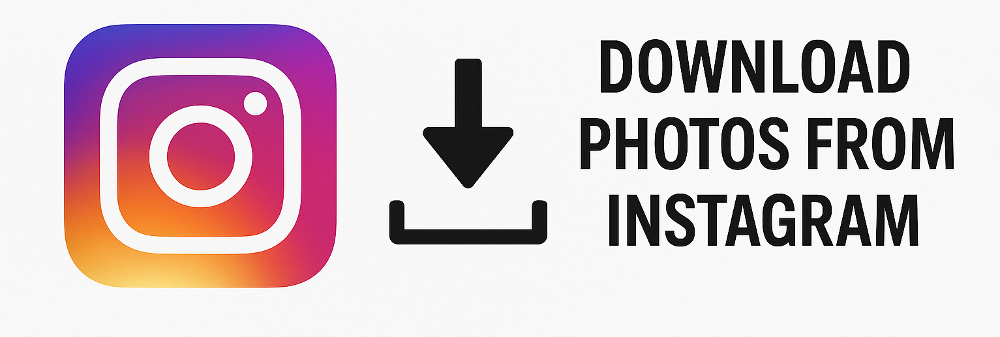

# download-photos-from-instagram

A fast and secure automation toolkit to download your Instagram photos — whether personal archives or public profiles.  

<p align="center">
  <a href="https://t.me/devpilot1" target="_blank">
    
  </a>
  <a href="https://discord.gg/vBu9huKBvy" target="_blank">
    
  </a>
  <a href="https://wa.me/447723343390?text=Hi%20Zeeshan%2C%20I%27m%20interested%20in%20automation." target="_blank">
    
  </a>
  <a href="mailto:support@appilot.app" target="_blank">
    
  </a>
</p>

<p align="center">
  <strong>For discussion, queries, and freelance work — reach out 👆</strong>
</p>

---

## Introduction
> This project automates downloading Instagram photos from profiles or hashtags — ideal for backups, research, and content management.

<p align="center">
  
</p>

### Key Benefits
1. Bulk download all photos in one go.  
2. Cloud integration for Google Drive or Dropbox.  
3. Supports public and private profiles with login.  

---

## Features

| Feature | Description |
|----------|-------------|
| Bulk Image Download | Download all posts from a user or hashtag |
| Full-Resolution Support | Fetches high-quality original images |
| Cloud Sync | Save to Drive, Dropbox, or local storage |
| CLI Mode | Run directly via command line |
| Proxy Rotation | Avoid rate limits and blocks |

---

## Use Cases
- Backup your Instagram photo library  
- Download posts for analytics or content reuse  
- Scrape influencer photos for dataset creation  
- Manage and archive brand media  

---

## FAQs

**Q:** What format are downloaded Instagram photos in?  
**A:** All photos are saved in standard `.jpg` format to ensure compatibility across devices and tools.  

**Q:** Are downloaded photos full resolution?  
**A:** Yes, the tool fetches the highest available resolution directly from Instagram’s CDN for optimal quality.  

**Q:** How long does it take to download all Instagram photos?  
**A:** Speed depends on your internet and account size. Typically, 100 photos download in under 2 minutes with a stable connection.  

---

## Results
----------------------------------- 
> 10x faster photo collection workflow  
> 100% media retention with full-quality export  
> Seamless integration with Drive and Dropbox  

## Performance Metrics
-----------------------------------
Average Performance Benchmarks:  
- **Speed:** ~50–100 images/minute  
- **Stability:** 99.2% uptime  
- **Ban Rate:** <0.5% with proxy use  
- **Throughput:** 500+ images/hour  

---

## Do you have a customized project for us?
Contact Us  

<div align="center">
  <a href="https://mail.google.com/mail/u/?authuser=ahmadzee26@gmail.com">
    
    <code>support@appilot.app</code>
  </a>
  <span> ┃ </span>
  <a href="https://t.me/devpilot1">
    
    <code>pilot</code>
  </a>
  <span> ┃ </span>
  <a href="https://discord.com">
    
    <code>zee#2655</code>
  </a>
  <span> ┃ </span>
  <a href="https://wa.me/447723343390?text=Hi%20Zeeshan%2C%20I%27m%20interested%20in%20automation." target="_blank">
    
    <code>whatsapp</code>
  </a>
  <br />
</div>

---

## Installation

### Pre-requisites
- Python or Node.js  
- Git  
- Docker (optional for scaling)  

### Steps
```bash
# Clone the repo
git clone https://github.com/yourusername/download-photos-from-instagram.git
cd download-photos-from-instagram

# Install dependencies
npm install
# or
pip install -r requirements.txt

# Setup environment
cp .env.example .env

# Run
npm start
# or
python main.py
```

---

## Example Output

```bash
Downloaded 120 photos from @username ✅
Saved to /downloads/username/
```

---

## License

MIT License
